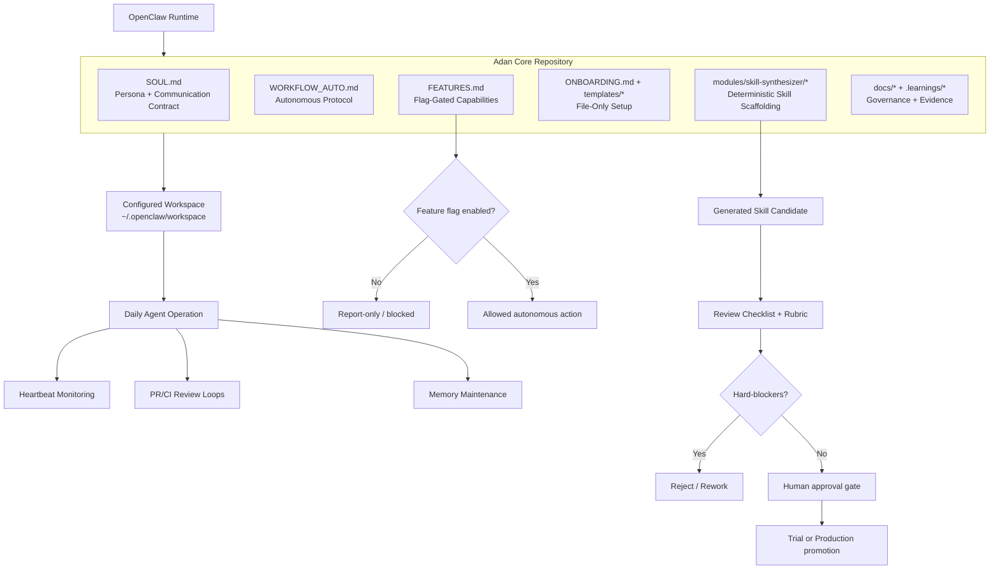

# Adan Core: Autonomous Staff Engineer Mode for OpenClaw

Adan Core is a file-first operating profile for OpenClaw.

It turns a general assistant into a proactive engineering collaborator by providing:
- identity and communication contract,
- autonomous execution protocol,
- structured onboarding and memory overlays,
- opt-in feature flags for safe growth.

## Visual Overview

---

## File-Only Philosophy

This project is intentionally platform-agnostic:
- no required shell scripts,
- no fixed clone path assumptions,
- no OS-specific install steps.

OpenClaw behavior is driven by files in your workspace.

---

## Prerequisites

Required:
- OpenClaw installed and running
- writable workspace at `~/.openclaw/workspace`

Recommended:
- VCS provider configured (GitHub/GitLab/Bitbucket/Azure DevOps/other)
- provider subscriptions configured for selected models/workflows
- a shared repository root convention (for your own operations)

---

## Install (Platform-Agnostic)

During onboarding, capture both:
- provider/subscription availability, and
- local tool availability (Gemini, Copilot, OpenCode, `gh`, local runtimes)

This lets Adan choose feasible workflows instead of assuming tools exist.

### Install path options

- **Root-file mode (recommended for maintainers):** use repository root files directly.
- **Drop-in skill mode (for workspace installers):** use `skills/adan-core/` and copy into `~/.openclaw/workspace/skills/adan-core`.

### 1) Get this repository anywhere on disk
Use any method you prefer (git clone, zip download, file sync).

### 2) Copy core files into OpenClaw workspace root
From this repository, copy:
- `SOUL.md` -> `~/.openclaw/workspace/SOUL.md`
- `WORKFLOW_AUTO.md` -> `~/.openclaw/workspace/WORKFLOW_AUTO.md`

If missing, create:
- `~/.openclaw/workspace/MEMORY.md`

### 3) Copy feature flags template
- `templates/adan.flags.example.json` -> `~/.openclaw/workspace/adan.flags.json`

### 4) Run onboarding via files
Follow `ONBOARDING.md` with:
- `templates/onboarding.answers.example.yaml`
- `templates/onboarding.auth-bootstrap.example.yaml`
- `templates/supplementary.*.md`

### 5) Merge model-role baseline (optional)
Use `templates/openclaw.adan-core.example.json5` as a starter for `~/.openclaw/openclaw.json`.

---

## Recommended Model Strategy (by Responsibility)

### Primary conversation (high-stakes reasoning)
- Recommended: `google-antigravity/claude-opus-4-6-thinking`
- Alternatives: `openai-codex/gpt-5.3-codex`, `github-copilot/claude-sonnet-4.6`

### Heartbeats / monitoring (high frequency)
- Recommended: `github-copilot/claude-haiku-4.5`
- Alternatives: `google-antigravity/gemini-3-flash`, local `ollama/*` (if stable)

### Sub-agents / autofix loops
- Recommended: `github-copilot/claude-haiku-4.5`
- Alternatives: `openai-codex/gpt-5.2-codex`, `google-antigravity/gemini-3-flash`

---

## Safety Defaults

- New capabilities are opt-in only.
- Feature flags default to conservative values.
- Run report-only for 24–48h before enabling autonomous write actions.
- High-risk actions require explicit human approval.

See `FEATURES.md`.

---

## Repository Structure

- `SKILL.md` — skill manifest
- `SOUL.md` — identity/persona contract
- `WORKFLOW_AUTO.md` — autonomous execution protocol
- `skills/adan-core/*` — drop-in workspace bundle for direct skill installation
- `ONBOARDING.md` — platform-agnostic onboarding flow
- `FEATURES.md` — feature-flag matrix and release policy
- `templates/openclaw.adan-core.example.json5` — model-role starter
- `templates/adan.flags.example.json` — feature-flag starter
- `templates/onboarding.answers.example.yaml` — onboarding input
- `templates/onboarding.checklist.md` — prerequisite checklist
- `templates/onboarding.presets/*.yaml` — provider-specific onboarding starters
- `templates/onboarding.auth-bootstrap.example.yaml` — provider state bootstrap record
- `templates/supplementary.*.md` — additive overlay templates
- `templates/learnings/*` — weekly refinement and governance logs
- `templates/ops-workers/*` — ops worker instance starters
- `docs/*` — quickstart, roadmap, meta-skill spec, quality/rubric/governance

---

## Docs

- `docs/event-quickstart.md`
- `docs/implementation-roadmap.md`
- `docs/meta-skill-spec.md`
- `docs/v0.3-execution-board.md`
- `docs/skill-quality-rubric.md`
- `docs/field-testing-protocol.md`
- `docs/field-testing-results-2026-02-28.md`
- `docs/v0.4-governance-proposal.md`
- `docs/provider-bootstrap-hints.md`
- `docs/ops-worker-multi-instance.md`
- `ONBOARDING.md`

## Optional Modules

- `modules/skill-synthesizer/` — feature-flagged MVP for safe skill scaffolding.
  - request contract: `templates/skill-request.example.yaml`
  - scaffold template: `templates/SKILL.template.md`
  - review gate: `REVIEW-CHECKLIST.md`
- `modules/ops-worker/` — feature-flagged multi-instance operations worker module.
  - instance schema: `modules/ops-worker/templates/ops-worker.instance.schema.yaml`
  - instance starter: `modules/ops-worker/templates/ops-worker.instance.example.yaml`
  - issue status template: `modules/ops-worker/templates/issue-comment.status.example.md`
  - output contract: `modules/ops-worker/OUTPUT-CONTRACT.md`

## Contribution Workflow

Adan Core follows linked-branch PR development.
See `CONTRIBUTING.md`.

## License

MIT
